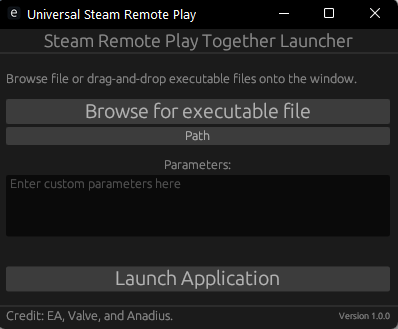

# This is reserved for bug or issues only!
Closed source but feel free to decompile the executable yourself, i don't use various technique to obfuscate the executable

useful information: 
- The executable is composed using [Tauri framework](https://tauri.app/) with [Rust language](https://www.rust-lang.org/) as backend
- Checkout [EGUI](https://github.com/emilk/egui/tree/master).

# Introduction

Use Steam Remote Play to play with your friend over the network.

## Requirements
- Install Steam - *yes steam **MUST** be installed and running*
- use windows 10/11 - *limited to windows for now im sorry :(*
- please run as admin - *Rust and windows limitation (for now)*

# Known Bugs
1. Using Admin Mode Drag and Drop doesn't work. (_Need more research_)
2. Sometimes Controller on the other end is not working as intended, use steam integration for controller for a workaround.

# How to Guide
This program use specifically overlayinjector.exe from various steam external game ( Uplay or Epic ) to inject steam_api.dll into an executable.

use steam_appid.txt to control game id you can get game id from [SteamDB](https://steamdb.info/).

you can **ONLY** use the game id you own so make sure to use that or use globally free game ex: [A.V.A Global](https://store.steampowered.com/app/1473480/AVA_Global/) use 1473480

PS: 
the **Path** button is hardcoded to be used as Ryujinx Data it is completely optional 

## First Look

